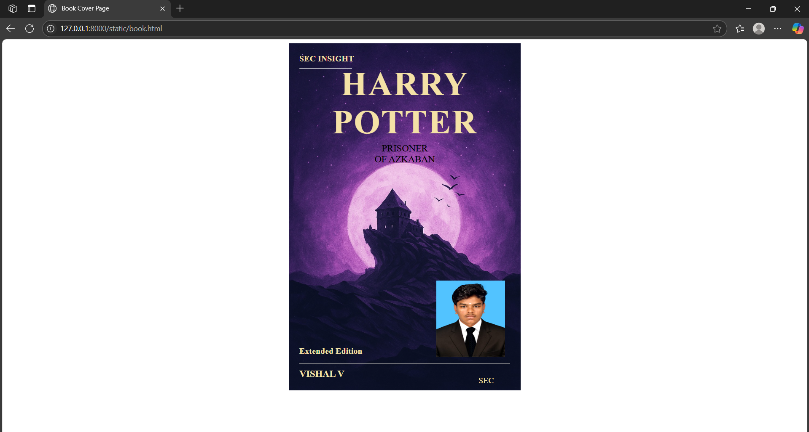

# Ex.06 Book Front Cover Page Design
## Date:

## AIM:
To design a book front cover page using HTML and CSS.

## DESIGN STEPS:

### Step 1:
Create a Django Admin project.

### Step 2:
Create an app in the Django interface.

### Step 3:
Create a folder named 'static' in the app folder.

### Step 4:
Create a new HTML file in the static folder.

### Step 5:
Write the HTML code with relevant CSS properties.

### Step 6:
Choose the appropriate style and color scheme.

### Step 7:
Insert the images in their appropriate places.

### Step 8:
Publish the website in the LocalHost.

## PROGRAM:
```
<!DOCTYPE html>
<html lang="en">
<head>
    <meta name="viewport" content="width=device-width, initial-scale=1.0">
    <style>
        .bookpage {
            width: 400px;
            height: 620px;
            margin-left: auto;
            margin-right: auto;
            padding: 20px;
            font-family: 'Adobe Garamond', serif;
            background-image: url("cover page.jpg"); 
            background-size: cover;
            background-position: center;
            color: #F4E1A6; 
        }

        .insight {
            color: inherit; 
            font-weight: bold;
            font-family: 'Adobe Garamond', serif;
        }

        .hrstyle {
            width: 100px;
        }

        .author {
            display: inline;
            position: relative;
            color: inherit; 
            top: 170px;
            font-family: 'Adobe Garamond', serif;
            font-size: large;
            font-weight: bold;
        }

        .booktitle {
          font-family: 'Adobe Garamond', serif;
          font-size: xx-large;
          text-align: center;
          position: relative;
          top: -50px; 
          font-weight: bold;
          letter-spacing: 2px;
          color: inherit;
        }

        .id {
            width: 400px;
            position: relative;
            top: 180px;
        }

        .pub {
            font-size: medium;
            position: relative;
            top: 145px;
            left: 340px;
            color: inherit;
            font-family: 'Adobe Garamond', serif;
        }

        .ed {
            color: inherit;
            font-size: medium;
            font-family: 'Adobe Garamond', serif;
            position: relative;
            top: 70px;
        }

        .subtitle {
            font-family: 'Adobe Garamond', serif;
            font-size: large;
            position: relative;
            top: -90px;
            color: black;
            text-align: center;
        }

        .mypic {
            position: relative;
            top: 130px;
            left: 260px;
            width: 100px;
            height: 100px;
            background-size: cover;
        }
    </style>
    <title>Book Cover Page</title>
</head>
<body>
    <div class="bookpage">
        <div class="insight">
           SEC INSIGHT
        </div>
        <div class="hrstyle">
            <hr style="color: red;">
        </div>
        <div class="booktitle">
            <h1>HARRY<BR>POTTER<br></h1>
        </div>
        <div class="subtitle">
            PRISONER<BR>OF AZKABAN
        </div>
        <div class="mypic">
            
        </div>
        <div class="id">
            <hr style="color: rgb(208, 255, 0);">
        </div>
        <div class="author">
            <p><b>VISHAL V</b></p>
        </div>
        <div class="pub">
            SEC
        </div>
        <div class="ed">
            <b>Extended Edition</b>
        </div>
    </div>
</body>
</html>
```
## OUTPUT:


## RESULT:
The program for designing book front cover page using HTML and CSS is completed successfully.
